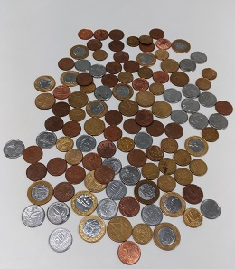

```{r setup, include=FALSE}
knitr::opts_chunk$set(echo = TRUE)
```


## Sumário

Durante a aula do dia 11/04/2017 do curso *Design and Analysis of Experiments*, cada um dos 29 alunos presentes deu sua estimativa para duas perguntas do professor Felipe Campelo:

1) Quantas moedas há no recipiente 1 (um copo de 200ml com moedas variadas padrão monetário Real)?
2) Qual o valor total contido no recipiente 2 (um copo de 200ml com moedas de R$0,05)?

No primeiro caso, as estimativas foram dadas de maneira cega (sem a interação entre alunos). No segundo caso, as estimativas foram dadas de maneira aberta (declarações sequenciais dos alunos em voz alta).

Os propósitos deste estudo de caso são, com base nas estimativas fornecidas, a) **definir a quantidade e o valor real** das perguntas acima, além de b) **investigar se conjuntos de alunos de engenharia são bons estimadores de pequenas quantidades pecuniárias**.

Para isso, inicialmente será feito um estudo de estatística descritiva do conjunto de dados coletados (as estimativas dos alunos), através de gráficos e descrições paramétricas, respondendo ao propósito **a** e obtendo uma ideia da qualidade do estimador conjunto de alunos de engenharia. 

Como não se sabe, a priori, a quantidade real (ou a média real da variável aleatória *quantidade de moedas em um copo cheio de 200ml*), são propostos testes adicionais com experimentação, para aprofundar a investigação do propósito **b**, através do estudo das seguintes questões de interesse:

- As estimativas rejeitam uma hipótese nula mais próxima da real? 
- As estimativas de conjuntos de alunos são consistentes entre si?
- As estimativas de conjuntos de alunos são sistematicamente rejeitadas por experimentação ?

## Preparação e Exploração dos Dados

Os dados coletados em sala são carregados no R e em seguida explorados, para se ter uma ideia dos valores obtidos

```{r Carregando os dados}
estimacao <- read.csv(file="./estimativa_da_sala.csv", header=TRUE, sep=";")
```

Primeiro, as estimativas de moedas são exploradas.

```{r Explorando as estimativas de Moedas}
summary(estimacao$Moedas)
hist(estimacao$Moedas)
shapiro.test(estimacao$Moedas)
```

Os dados estimados para a quantidade de moedas tem uma distribuição que pode ser aproximada da normal, uma vez que o valor p<<<0.1 para o teste Shapiro-Wilk. **[1]**.
Além disso, como não a a presença de *outliers* significativos e como não se trata de valores nominais, o parâmetro do estimador será definido como a média **[2]**.

Em seguida, as estimativas de valores são exploradas.

```{r Explorando as estimativas de Valor}
summary(estimacao$Valor)
hist(estimacao$Valor)
shapiro.test(estimacao$Valor)
```

Assim como para as estimativas de moedas, a distribuição para as estimativas de valor pode ser assumida como normal pelo mesmo motivo, p<0.01, mas com um valor significativamente maior. O maior resultado de p, significando uma "menor normalidade" na distribuição, pode ser explicada pela não independência dos dados, pelo fato de terem sido coletados de forma aberta.
De qualquer forma, pelos resultados e pelas mesmas justificativas das estimativas de moedas, será utilizado o parâmetro média para o estimador.


## Estatística Descritiva das Estimativas

### Quantidade de Moedas no Recipiente 1

#### Descrição da coleta de dados

As estimativas dos alunos para a primeira pergunta foram escritas em folhas de papel e entregues ao professor, que informou aos alunos o valor de cada uma. 

Assume-se que:

- Não houve interação entre os alunos (i.e. nenhum aluno trapaceou e consultou outros a respeito das estimativas ou leu do papel de um colega alguma estimativa)
- Não houve erro na leitura das estimativas por parte do professor
- Não houve erro na anotação das estimativas por parte do grupo

No caso da última premissa, outros grupos foram consultados e os valores conferidos, de forma a minimizar a chance de ocorrência de erro. Em relação às outras premissas, a verificação só poderia ser feita caso o professor tenha guardado os papéis ou, e.g. houvesse uma câmera na sala para flagrar algum aluno trapaceando as instruções.

#### Análise Estatística

Após a análise exploratória dos dados, para definir a quantidade real de moedas no recipiente 1, baseado nos dados coletados em sala, será calculada a média e o erro médio das estimativas.


```{r}
med_est_moed<-mean(estimacao$Moedas)
desvio_pad_moed<-sd(estimacao$Moedas)
erro_med_moed<-sd(estimacao$Moedas)/sqrt(length(estimacao$Moedas))
inter_conf_moed<-c(med_est_moed-2*erro_med_moed,med_est_moed+2*erro_med_moed)
```
```{r echo=FALSE}
cat("Estimativa de Média é:",med_est_moed)
cat("Intervalo de Confiança 95% é:",inter_conf_moed)
cat("Desvio padrão do estimador é:",desvio_pad_moed)
```

Desta forma, considerando que o estimador em questão não posssui viés, i.e. $\begin{gather} E(\Phi)=\theta \end{gather}$, a quantidade de moedas no recipiente 1, com 95% de confiança, é de 89 $\pm$ 18. Ou seja, este intervalo tem uma chance de 95% de capturar o a quantidade de moedas real no recipiente 1, considerando que ele não tenha viés e que sua distribuição seja normal.

O desvio padrão encontrado, de 49.43, indica uma dispersão muito grande em torno da estimativa de média (56% do valor da média), o que indica uma precisão muito pequena do estimador. 

### Valor no Recipiente 2

#### Descrição da coleta de dados

Para a segunda pergunta, as estimativas do valor contido no recipiente 2 foram dadas em voz alta, na ordem em que os alunos se encontravam e os grupos foram anotando as respostas. 

Desta forma, será assumido apenas que:

- Não houve erro na anotação das estimativas por parte do grupo

Da mesma forma que a primeira estimativa, os valores anotados foram conferidos entre grupos para verificar essa premissa.

#### Análise Estatística

Após a análise exploratória dos dados, para definir o valor real de moedas no recipiente 2, baseado nos dados coletados em sala, será calculada a média e o erro médio das estimativas.


```{r}
med_est_val<-mean(estimacao$Valor)
desvio_pad_val<-sd(estimacao$Valor)
erro_med_val<-sd(estimacao$Valor)/sqrt(length(estimacao$Valor))
inter_conf_val<-c(med_est_val-2*erro_med_val,med_est_val+2*erro_med_val)
```

```{r echo= FALSE}
cat("Estimativa de Média é:",med_est_val)
cat("Intervalo de Confiança 95% é:",inter_conf_val)
cat("Desvio padrão do estimador é:",desvio_pad_val)
```

Desta forma, considerando que o estimador em questão não posssui viés, i.e. $\begin{gather} E(\Phi)=\theta \end{gather}$, o valor contido no recipiente 2, com 95% de confiança, é de R\$4.60 $\pm$ R\$0.60. Ou seja, este intervalo tem uma chance de 95% de capturar o valor real contido no recipiente 2, considerando que ele não tenha viés e que sua distribuição seja normal.

The method used to derive the interval has a hit rate of
95%" - i.e., the interval generated has a 95% chance of "capturing"
the true population parameter.

O desvio padrão encontrado, de R\$1.58, indica uma dispersão muito grande em torno da estimativa de média (34% do valor da média), o que indica uma precisão muito pequena do estimador. No entanto, observou-se um valor percentual menor do que para a quantidade de moedas, que pode ser explicado pelo método de coleta de dados, em que cada aluno pode ter sido influenciado pela opinião dos colegas que estimaram antes dele.

### Análise da Estatística Descritiva

Os estimadores para quantidade de moedas e valor em copos de 200ml produziram, neste caso, resultados pouco precisos, o que poderia indicar uma má qualidade na estimação. Além disso, a premissa de que eles não possuem viés não pode ser confirmada a priori, uma vez que o valor real dos parâmetros não são conhecidos. Para aprofundar essa investigação, novos experimentos foram propostos, através da experimentação, como detalhado nas seções seguintes.

## Planejamento Experimental

Conforme mencionado no sumário, para aprofundar a investigação da qualidade dos estimadores formados por "conjuntos de alunos de engenharia", são propostos experimentos para responder a questões de interesse adicionais.

### Recipiente I 

#### As estimativas rejeitam uma hipótese nula mais próxima da real?

O primeiro experimento a ser conduzido terá como método a Prova por Contradição através do teste de hipóteses. Ou seja, através de experimentos, serão criadas amostras da população de interesse, i.e. a variável aleatória *quantidade de moedas em um copo de 200ml cheio de moedas variadas*. A partir das amostras, será definida uma hipótese nula (média do resultado experimental $\mu_e$) a ser testada pelas estimativas produzidas em sala:

$$\begin{cases} H_0: \mu = \mu_e \\ H_1: \mu\neq\mu_e\end{cases}$$

A partir de parâmetros experimentais adequados, os resultados poderão levar a duas conclusões:

- $H_0$ rejeitada: como a hipótese nula é um valor mais próximo do real, caso ela seja rejeitada, pode-se concluir que, *para este caso específico*, conjuntos de alunos de engenharia não produziram um bom estimador, uma vez que "um estimador deve ser de alguma forma "próximo" do valor real do parâmetro desconhecido", de acordo com a Seção 7.2.1, de [3].

- Falhou em rejeitar $H_0$: se, com as estimativas da sala, evidências suficientes não foram encontradas para rejeitar a hipótese nula, conclui-se que, *para este caso específico*, conjuntos de alunos de engenharia produziram um bom estimador.

É importante explicar o termo destacado em itálico, que significa que as conclusões desse teste servem apenas para qualificar ou desqualificar os estimadores para uma estimativa específica, não podendo ser generalizada. Para tentar investigar mais profundamente, novos teste serão necessários.

##### Desrição da coleta de dados
        
Um copo de 200ml semelhante ao utilizado pelo professor e diversas moedas dos variados tipos foram coletadas, de forma que a quantidade total fosse muito maior do que a capacidade do copo. Para que as amostras fossem feitas da forma mais fiel possível à real (coleta de moedas da "caixinha da paçoca" do laboratório ORCS da UFMG), a proporção de moedas de 1 real, cinquenta, vinte e cinco, dez e cinco centavos deveria ser igual (considerando que moedas de 1 centavo não foram inseridas na caixinha). COmo a proporção real não tem como ser averiguada, a proporção do experimento será comparado ao meio circulante nacional do dia 11/04/2017 (data esperada da coleta de moedas), informação disponível no site do Banco Central do Brasil [4].

Para fins de reproducibilidade a quantidade de moedas de cada tipo é apresentada: 22 moedas de 1 real, 21 moedas de 50 centavos, 30 de 25 centavos, 60 de 10 centavos e 43 de 5 centavos.

A comparação das proporções de moedas do experimetno com o meio circulante nacional são apresentadas a seguir:

``` {r proporção moedas experimentos}

moedas_exp<-c(22,21,30,60,43)
prop_exp<-round(moedas_exp/sum(moedas_exp)*100)
prop_mcn<-c(16,13,14,30,28)
moedas<-c("1","0,50","0,25","0,10","0,05")

print(data.frame(moedas,prop_exp,prop_mcn))

```

Nota-se uma diferença pequena nas proporções das moedas do experimentos com as moedas do meio circulante nacional, o que sugere que a aproximação do experimento com o real é boa.

As moedas coletadas são apresentadas na figura abaixo:



Um exemplo de amostra coletada é apresentado na figura abaixo:


As moedas foram reunidas em um estojo que era misturado antes de cada amostra. O copo era então inserido no estojo e enchido de moedas para ser contado. Ao ser removido do estojo, era feita uma avaliação pelo grupo se o nível de enchimento do copo era semelhante ao do dia das estimativas e, em caso negativo, uma nova amostra era coletada.

Para as amostras aprovadas, a quantidade de moedas foi contada e anotada.

Como o objetivo desse experimento é encontrar uma hipótese nula a ser usada na prova por contradição, não é necessário uma definição de tamanho amostral. A quantidade de amostras foi definida de forma qualitativa, observando-se a dispersão entre cada amostra.

##### Análise Exploratória dos Dados

Os resultados observados após 5 amostras foi considerado satisfatório (desvio padrão relativo pequeno), para se definir uma hipótese nula.

``` {r experimento moedas}

experimento <- read.csv(file="./resultados_experimentais.csv", header=FALSE, sep=";")

```


``` {r echo=FALSE}
print(experimento$V1)
cat("Média dos resultados experimentais é:",mean(experimento$V1))
cat("Desvio padrão dos resultados experimentais é:",sd(experimento$V1))

```

##### Teste de Hipóteses

Finalmente, um teste t pode ser realizado para 


        
- As estimativas rejeitam uma hipótese nula mais próxima da real? 
- As estimativas de conjuntos de alunos são consistentes entre si?
- As estimativas de conjuntos de alunos são sistematicamente rejeitadas por experimentação ?


## Referências
[1] Patrick Royston (1995) Remark AS R94: A remark on Algorithm AS 181: The W test for normality. Applied Statistics, 44, 547-551.

[2] https://www.wyzant.com/resources/lessons/math/prealgebra/representing-data. Acessado em 13/04/2017

[3] D.C. Montgomery, G.C. Runger, Applied Statistics and Probability for Engineers, 5th ed., Wiley, 2010.

[4] http://www4.bcb.gov.br/adm/mecir/principal.asp. Acessado em 13/04/2017